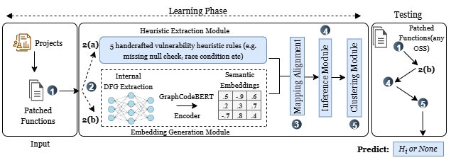

<h1 align="center"><strong>HYDRA</strong></h1>
<h3 align="center"><em>A Hybrid Heuristic-Guided Deep Representation Architecture for Predicting Latent Zero-Day Vulnerabilities in Patched Functions</em></h3>

**HYDRA** is a hybrid vulnerability analysis framework designed to uncover latent **zero-day vulnerabilities** in patched functions. It combines rule-based static analysis with deep learning techniques specifically, GraphCodeBERT embeddings and a Variational Autoencoder (VAE) to identify **"silent vulnerabilities"** that persist after fixes due to incomplete patches or overlooked risks. HYDRA operates in an **unsupervised** setting and was evaluated on three real-world projects **Chrome**, **Android**, and **ImageMagick** where it successfully predicted **13.7%**, **20.6%**, and **24%** of patched functions, respectively, as containing potential latent risks. HYDRA outperforms baselines using only regex-based or hybrid symbolic models by surfacing deeply buried but risky patterns strengthening the case for hybrid vulnerability prediction in security audits.  

## Architecture of HYDRA

  

## HYDRA Framework Overview
HYDRA combines:

1. **Heuristic Feature Extraction:** Encodes a set of expert defined vulnerability prediction rules derived from common insecure coding practices (e.g., missing null checks, unsafe memory allocation).
2. **GraphCodeBERT Encoder:** A pretrained deep learning model specifically designed for source code, GraphCodeBERT transforms input functiones code into rich context-aware embeddings that capture both syntax (e.g., control/data flow) and semantics (e.g., variable interactions).
3. **VAE-Based Latent Space Projection:** HYDRA uses a **Variational Autoencoder (VAE)** to compress high-dimensional code embeddings into a lower-dimensional latent space, making it easier to observe hidden structure in code representations.
4. **K-Means Clustering:**  K-Means clustering is employed to reveal semantic groupings of patched functions, highlighting similarities across risky and "None" labeled examples and enabling unsupervised discovery of latent vulnerability signals.

## Dataset

The Dataset we used in the paper:

1. **Big-Vul** [[https://drive.google.com/file/d/1-0VhnHBp9IGh90s2wCNjeCMuy70HPl8X/view?usp=sharing](https://drive.google.com/file/d/1-0VhnHBp9IGh90s2wCNjeCMuy70HPl8X/view?usp=sharing)]  
   A large dataset of known vulnerabilities with vulnerable and fixed code function pairs.  

## [t-SNE Visualization of HYDRA](./HYDRA//artifacts//RQ2%20and%20RQ3/t-SNE-and-metrics-score-for-HYDRA/)

   
   
  

## [t-SNE Visualization from Other Models](./HYDRA//artifacts//RQ2%20and%20RQ3/t-SNE-and-metrics-score-for-other-models/)

## [Unsupervised Clustering Metrics Score of HYDRA](./HYDRA//artifacts//RQ2%20and%20RQ3/t-SNE-and-metrics-score-for-HYDRA/unsupervised-metrics-score.png)

  

## [Unsupervised Clustering Metrics Score from Other Models](./HYDRA//artifacts//RQ2%20and%20RQ3/t-SNE-and-metrics-score-for-other-models/)

## [VAE Reconstruction Loss Curve of HYDRA](./HYDRA//artifacts//RQ2%20and%20RQ3/t-SNE-and-metrics-score-for-HYDRA/VAE-loss-curve-HYDRA.png)

  

  

## References

[1] Jiahao Fan, Yi Li, Shaohua Wang, and Tien Nguyen. A C/C++ Code Vulnerability Dataset with Code Changes and CVE Summaries. MSR 2020.